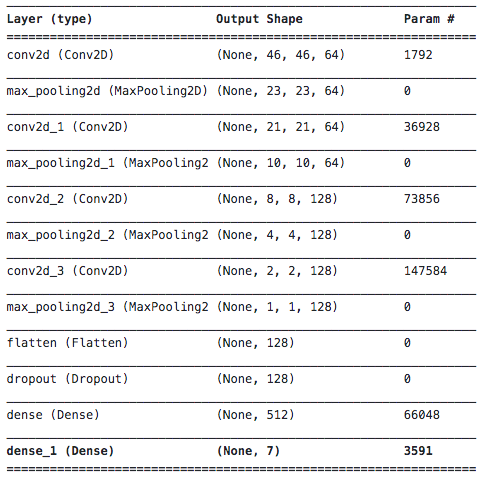
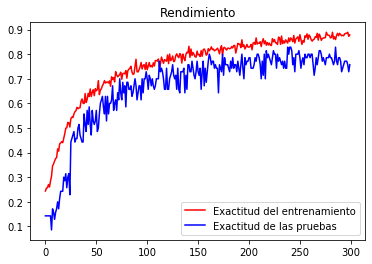
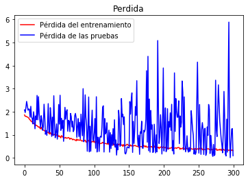
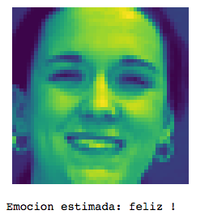

# reconocedor-emociones
Este repositorio utiliza una red neuronal convolucional de 8 capas (cov2d y maxpool) para clasificar las emociones de un conjunto de imágenes de entrenamiento.

## Dataset
Este ejemplo utiliza el dataset de emociones CK+ (tipo [FACS](https://imotions.com/blog/facial-action-coding-system/)) el cual debe descargar y ponerlo en la raíz. Desgargar el [CK.zip](https://drive.google.com/file/d/147cNhQBOCUcg5o2AYQxe1s7fVe-Fwvej/view?usp=sharing)

Debe extraer el zip de tal forma de que quede la siguiente estructura:

- CK
  - anger
  - contempt
  - fear
  - happy
  - sadness
  - surprise

- CK_PRUEBAS
  - anger
  - contempt
  - fear
  - happy
  - sadness
  - surprise

cada folder contiene imágenes de 48x48 pixeles en blanco y negro.

## predecir-emociones.ipynb
Este archivo es un cuaderno de Jupyter (Jupyter Notebook) para ejecutar este cuaderno, por favor instale Anaconda y Python 3.6.

### reconocedor-facial.h5
Este archivo contiene los pesos de la red neuronal (CNN) ya entrenada, así que puede utilizar este archivo para cargar la red y realizar predicciones sin tener que volver a entrenar la red.

## Rendimiento
Este experimento ha obtenido un 96% de precisión sobre el set de entrenamiento y un 84% sobre el set de pruebas.

## Ejemplo de Predicción

